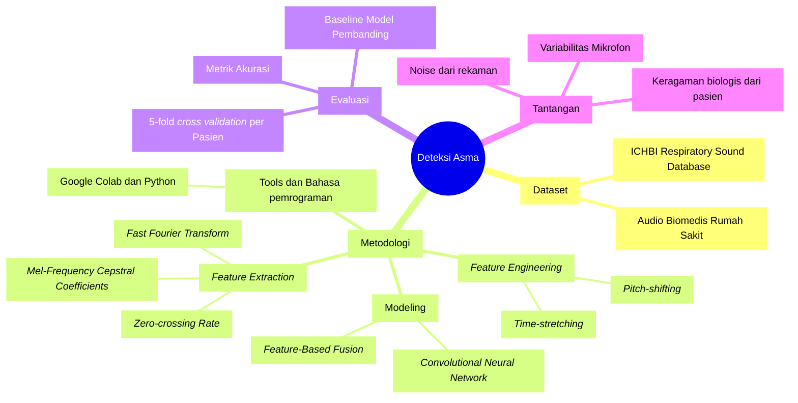

ID: 20924303
Name: Giovaldi Ramadhan

# 1. Mind Map and Concept Map:
## Deteksi Penyakit Asma menggunakan *Feature-Based Fusion* dan *Convolutional Neural Network*
## Mindmap

## Concept Map: 

```mermaid
graph TB
  %% Konsep Utama
  Asma[Deteksi Asma]

  %% Dataset
  Asma -->|memanfaatkan| Dataset[Dataset]
  Dataset -->|terdiri dari| Audio1[Audio Biomedis<br>Rumah Sakit]
  Dataset -->|terdiri dari| Audio2[ICHBI Respiratory<br>Sound Database]

  %% Metodologi
  Asma -->|menggunakan| Metodologi[Metodologi]
  Metodologi -->|melibatkan| Tools[Tools & Bahasa Pemrograman]
  Tools -->|misalnya| Colab[Google Colab & Python]

  Metodologi -->|melakukan| FE[Feature Extraction]
  FE -->|meliputi| ZCR[Zero-crossing Rate]
  FE -->|meliputi| MFCC[Mel-Frequency<br>Cepstral Coefficients]
  FE -->|meliputi| FFT[Fast Fourier Transform]

  Metodologi -->|melakukan| FG[Feature Engineering]
  FG -->|meliputi| PS[Pitch-shifting]
  FG -->|meliputi| TS[Time-stretching]

  Metodologi -->|membangun| Modeling[Modeling]
  Modeling -->|menggunakan| CNN[Convolutional Neural Network]
  Modeling -->|menggunakan| Fuse[Feature-Based Fusion]

  %% Evaluasi
  Asma -->|dievaluasi dengan| Evaluasi[Evaluasi]
  Evaluasi -->|mengukur| Acc[Metrik Akurasi]
  Evaluasi -->|menguji dengan| CV[5-fold cross-validation<br>per Pasien]
  Evaluasi -->|membandingkan| Baseline[Baseline Model<br>Pembanding]

  %% Tantangan
  Asma -->|dihadapkan pada| Tantangan[Tantangan]
  Tantangan -->|termasuk| Mic[Variabilitas Mikrofon]
  Tantangan -->|termasuk| Noise[Noise dari Rekaman]
  Tantangan -->|termasuk| Bio[Keragaman Biologis<br>dari Pasien]
```

# 2. Data Science and Python venv

a. Explain in brief about data science : 
suatu proses scientific untuk mentransformasikan data menjadi sebuah insight untuk membuat keputusan yang lebih baik. Tujuan umumnya sendiri untuk mengubah data menjadi actionable value making better decisions

b. What are the differences between data, data science, and data scientist? 
- *Data* adalah kumpulan fakta, angka, kata, pengamatan, atau informasi berguna lainnya yang dikumpulkan dari berbagai sumber. Organisasi mengolah data mentah tersebut melalui proses pemrosesan dan analisis untuk menghasilkan wawasan yang dapat meningkatkan pengambilan keputusan. Dalam konteks kecerdasan buatan, data berfungsi sebagai “bahan bakar” yang memerlukan dua elemen utama: kuantitas dan kualitas yang memadai. referensi: https://www.ibm.com/think/topics/data?
- *Data Science* adalah bidangnya yang mana menggabungkan banyak disiplin ilmu seperti matematika, ilmu komputer, rekayasa perangkat lunak, dan statistik. Fokusnya adalah pada pengumpulan dan pengelolaan data berskala besar—baik terstruktur maupun tidak terstruktur—untuk aplikasi akademik, bisnis, atau penelitian. Bidang ini juga melibatkan penggunaan metode seperti machine learning, kecerdasan buatan, pemrosesan bahasa alami, dan alat analitik lainnya untuk mengekstrak wawasan dari data. referensi: https://www.ibm.com/think/topics/data-science-vs-data-analytics?
- *Data Scientist* adalah profesionalnya yang ahli mengekstrak wawasan spesifik industri dari data mentah. Mereka memiliki keterampilan ilmu komputer dan ilmu murni (seperti statistik dan matematika) yang lebih mendalam daripada analis data biasa, serta pemahaman mendalam tentang domain bisnis di mana mereka bekerja. Seorang data scientist menggunakan data untuk memahami dan menjelaskan fenomena di sekitarnya, membantu organisasi mengambil keputusan yang lebih baik. referensi: https://www.coursera.org/articles/what-is-a-data-scientist?

c. Explain about the four foundational aspects of data science?
- Matematika: Akan mencakup konsep dasar matematika, seperti fungsi, relasi, asumsi, kesimpulan, dan abstraksi, sehingga konsep-konsep tersebut dapat digunakan untuk mendefinisikan dan memahami berbagai aspek manipulasi data.
- Teknologi: Pengetahuan Python akan diperluas dari prasyarat dengan fungsi manipulasi tabel yang lebih canggih, latihan tambahan pada tugas pembersihan dan manipulasi data, penggunaan notebook komputasi (seperti Jupyter), serta GitHub untuk pengendalian versi dan publikasi proyek.
- Visualisasi: Jenis plot baru akan dipelajari untuk berbagai tipe data dan tujuan komunikasi yang ingin dicapai. Prinsip umum tentang kapan dan bagaimana menggunakan visualisasi akan dipelajari.
- Komunikasi: Cara menulis komentar dalam kode, dokumentasi kode, motivasi dalam notebook komputasi, interpretasi hasil dalam notebook komputasi, dan laporan teknis tentang hasil analisis. Kejelasan, kekonkretan (ringkas), dan pemahaman audiens sasaran akan menjadi prioritas.

d. List link on PyPI for installing JupyterNotebook, Matplotlib, NumPy.
- Link untuk matplotlib: https://pypi.org/project/matplotlib/
- Link untuk jupyter notebook: https://pypi.org/project/notebook/
- Link untuk Numpy: https://pypi.org/project/numpy/

e. Create a virtual environment, install some packages, and save information to requirements.txt, create other virtual environment and use requirement.txt. Show the screenshots for all processes.

- Create a virtual environment:

- Install some packages:

- Save information to requirements.txt

- create other virtual environment
 

- use requirement.txt

# 3. Practicing Python for ML

[Google Colab](https://colab.research.google.com/drive/1ZkRGafx5c-Shr0DXUGF-etgvMLrpfKXp?usp=sharing)
